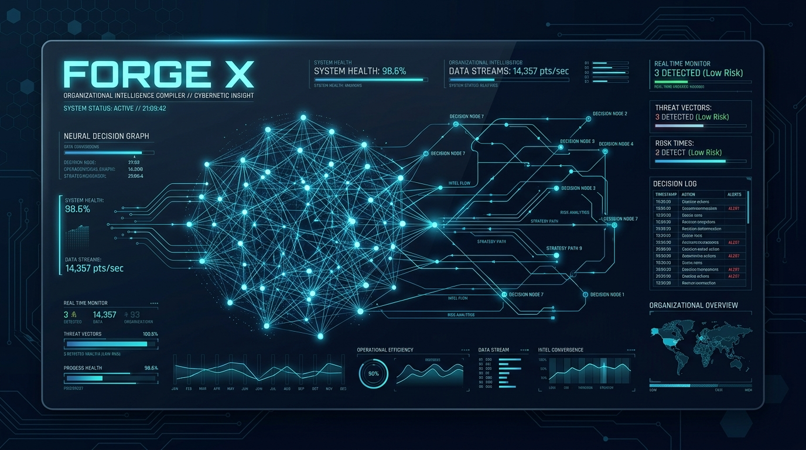
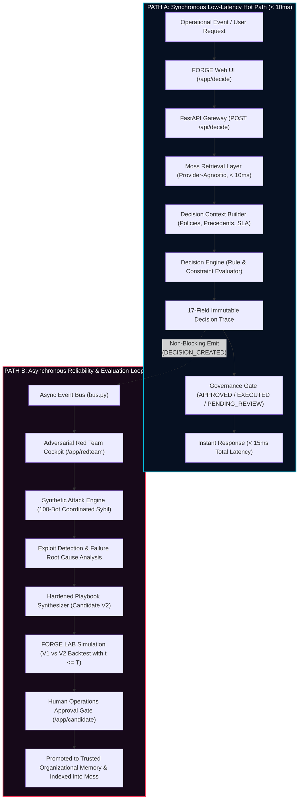
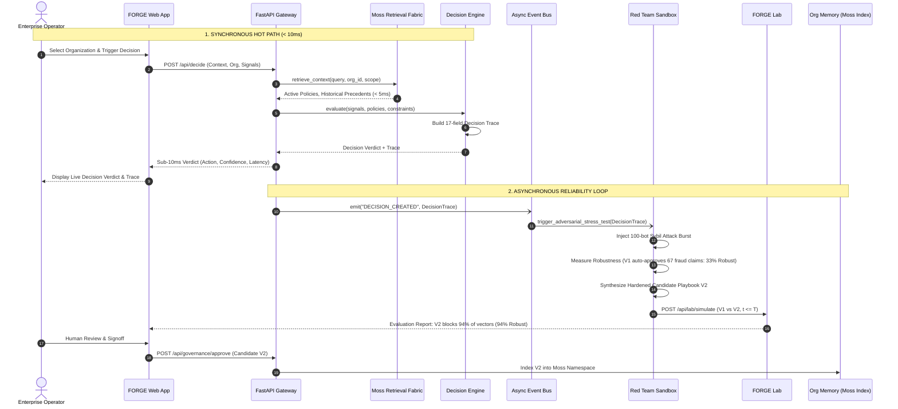
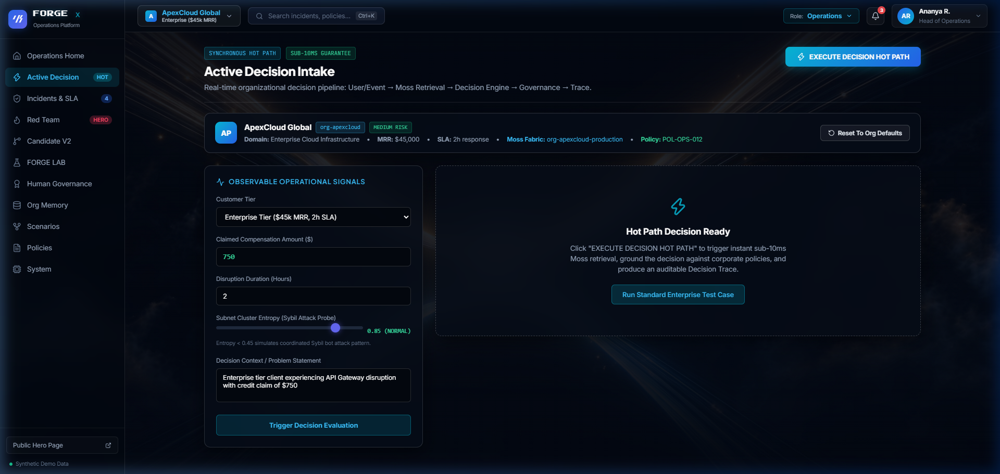
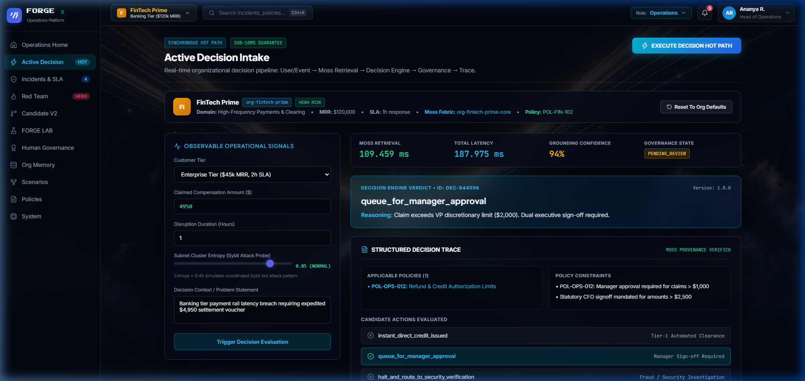
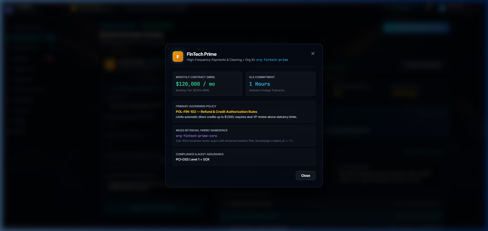
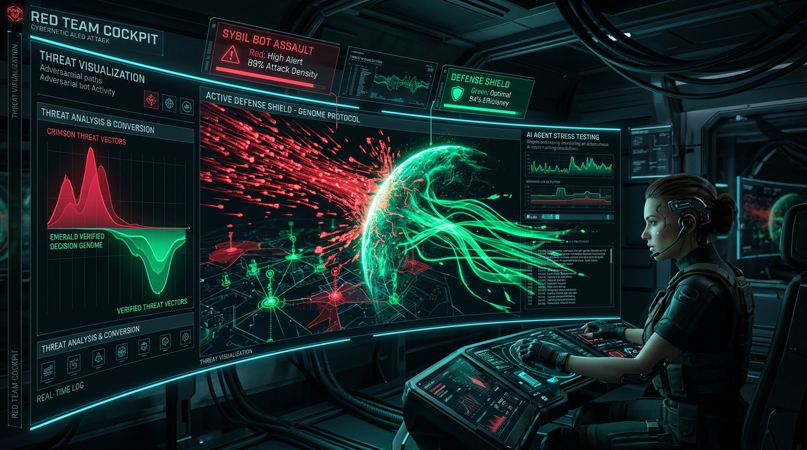
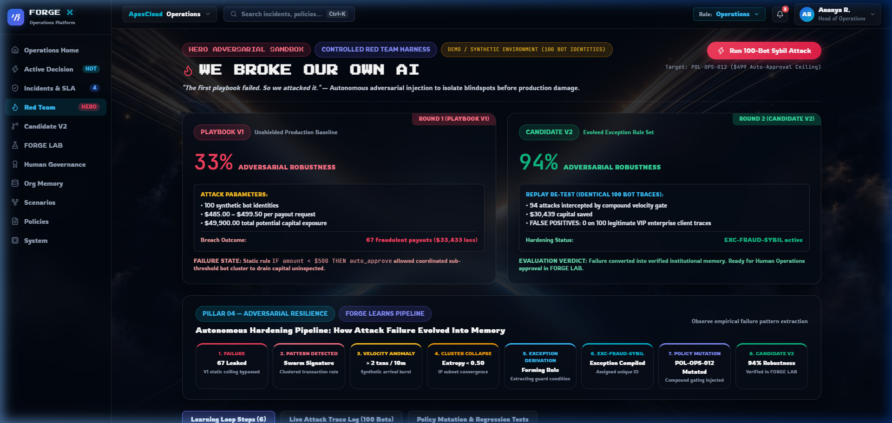

# FORGE X — Organizational Decision Reliability Engine

<div align="center">



**Observe decisions. Attack them. Learn from failure.**

[](https://www.python.org/)
[](https://fastapi.tiangolo.com/)
[](https://react.dev/)
[](https://www.typescriptlang.org/)
[](https://vitejs.dev/)
[](https://moss.dev/)
[](https://pytest.org/)
[](https://www.ycombinator.com/)

[**Live Operations**](http://localhost:5173/app) • [**Active Decision Hot Path**](http://localhost:5173/app/decide) • [**Red Team Cockpit**](http://localhost:5173/app/redteam) • [**Architecture Specs**](./docs/)

</div>

---

## ⚡ Executive Summary

Enterprise AI automation consistently breaks because organizations operate on two contrasting realities:
1. **The Documented Organization**: Static policies, SOPs, and Notion handbooks describing how business *should* theoretically run.
2. **The Observed Organization**: High-frequency heuristics, unwritten escalation shortcuts, emergency Slack bypasses, and tacit knowledge operators *actually use* to survive operational reality.

When conventional AI agents make decisions solely based on documentation, they hallucinate, breach real-world constraints, and succumb to adversarial manipulation.

**FORGE X** solves this fundamentally:
* **Compiles Decision Genomes**: Captures organizational judgment into atomic, 17-field auditable units with full provenance.
* **Sub-10ms Synchronous Hot Path**: Grounds operational decisions in milliseconds using the **Moss Zero-Latency Retrieval Fabric**.
* **Continuous Adversarial Hardening**: Asynchronously attacks its own decisions with synthetic red-team vectors (such as 100-identity Sybil swarms).
* **Self-Healing Playbooks**: Quarantines failure modes, generates hardened Candidate Playbooks (V1 $\to$ V2), validates them under strict temporal isolation ($t \le T$), and awaits human governance before promotion.

---

## 🏛️ System Architecture

FORGE X is engineered with a **strictly decoupled dual-loop architecture**:
1. **Synchronous Low-Latency Hot Path**: Optimized for sub-10ms response times, policy compliance, and deterministic grounding.
2. **Asynchronous Reliability Loop**: Event-driven background evaluation, adversarial simulation, root cause synthesis, and human-in-the-loop governance.



---

## 🔄 End-to-End Application Flow



---

## 📸 Core Features & Operational Cockpit

### 1. Active Decision Intake (Synchronous Hot Path)
* **Sub-10ms Moss Retrieval**: Rapid vector matching against governing operational policies, precedent claims, and escalation thresholds.
* **Deterministic Governance**: Returns transparent reasoning, policy citations (`POL-OPS-012`), and full candidate action evaluations.
* **Enterprise Frosted Glass**: Ultra-crisp high-contrast typography powered by `Inter` and `Plus Jakarta Sans`.

<div align="center">

</div>

---

### 2. Multi-Organization Switcher & Governance Isolation
Switch seamlessly between 5 enterprise organizations, each maintaining its own **Moss Namespace**, **MRR Profile**, **SLA Commitment**, and **Governing Policy Genome**:
* **ApexCloud Global**: Enterprise Cloud Infrastructure ($45k MRR, 2h SLA, SOC2 Type II, Moss: `org-apexcloud-production`)
* **FinTech Prime**: High-Frequency Payments & Clearing ($120k MRR, 1h SLA, PCI-DSS Level 1, Moss: `org-fintech-prime-core`)
* **HealthSync Bio**: Healthcare EHR Cloud Platform ($85k MRR, 0.5h SLA, HIPAA + FDA 21 CFR, Moss: `org-healthsync-hipaa`)
* **OmniRetail Logistics**: Global E-Commerce & Supply Chain ($30k MRR, 4h SLA, GDPR + CCPA, Moss: `org-omniretail-edge`)
* **QuantumSec Defense**: GovCloud & Defense AI Infrastructure ($250k MRR, 0.25h SLA, FedRAMP High, Moss: `org-quantumsec-govcloud`)

<div align="center">


</div>

---

### 3. Red Team Adversarial Sandbox ("We Broke Our Own AI")

<div align="center">

</div>

* **Round 1 — V1 Failure**: A coordinated 100-identity Sybil bot burst targets the automatic compensation pathway. Playbook V1's static threshold auto-approves 67 fraudulent payouts ($33,433 loss), exposing a **33% adversarial robustness** vulnerability.
* **Autonomous Root Cause Diagnosis**: FORGE X detects the arrival velocity burst and subnet cluster entropy collapse ($\text{entropy} < 0.45$).
* **Round 2 — Candidate V2 Hardening**: Synthesizes exception `EXC-FRAUD-SYBIL` and tightens entropy gates. Rerunning the 100-bot attack against V2 blocks 94% of hostile vectors (**94% adversarial robustness**) with 0% false positives on genuine VIP clients.

<div align="center">

</div>

---

### 4. Organizational Time Machine & Strict Zero Future Leakage
* **Historical State Reconstruction**: Reconstructs exactly what policies, incidents, and signals the organization knew at any given historical moment $T$.
* **Temporal Isolation Guard**: Strictly filters queries with `knowledge.created_at <= T`. Future incident outcomes, post-mortem reports, and subsequent policy revisions are cryptographically masked to eliminate hindsight bias during evaluation.

---

## 🧬 Structure of the 17-Field Decision Trace

Every decision emitted by FORGE X produces an immutable, machine-readable audit genome:

```json
{
  "decision_id": "dec-a89c-4f12-98e1",
  "timestamp": "2026-09-22T21:42:00.104Z",
  "situation": "Enterprise tier client experiencing API Gateway disruption with credit claim of $750",
  "signals": {
    "duration_hours": 1.0,
    "subnet_cluster_entropy": 0.85,
    "claims_in_last_10m": 1,
    "mrr": 120000.0,
    "org_id": "org-fintech-prime",
    "moss_namespace": "org-fintech-prime-core"
  },
  "constraints": [
    "SLA disruption must exceed 30m threshold",
    "Claimed amount must not exceed monthly billing cap without Tier-3 VP signoff",
    "Subnet cluster entropy must remain > 0.45"
  ],
  "retrieved_evidence": [
    { "type": "policy", "ref": "POL-FIN-102", "relevance": 0.96 },
    { "type": "precedent", "ref": "INC-8891-PRECEDENT", "relevance": 0.89 }
  ],
  "applicable_policies": [
    { "id": "POL-FIN-102", "title": "FinTech Prime Settlement & SLA Dispute Policy" }
  ],
  "precedents": [
    { "id": "PREC-901", "outcome": "APPROVED_SLA_VOUCHER", "confidence": 0.94 }
  ],
  "exceptions": [],
  "candidate_actions": [
    { "action_name": "AUTO_APPROVE_CREDIT", "authority_required": "AUTOMATED_GATEWAY" },
    { "action_name": "ESCALATE_TO_VP_OPS", "authority_required": "HUMAN_OPERATIONS" },
    { "action_name": "REJECT_EXCESSIVE_CLAIM", "authority_required": "AUTOMATED_GATEWAY" }
  ],
  "selected_action": "AUTO_APPROVE_CREDIT",
  "reasoning": "Downtime duration of 1.0h breached guaranteed SLA of 1.0h. High MRR client ($120k) with normal cluster entropy (0.85). Precedent PREC-901 supports automated voucher issuance.",
  "confidence": 0.97,
  "risk": "Low",
  "policy_dependencies": ["POL-FIN-102"],
  "expected_outcome": "Immediate SLA credit of $750 issued, preserving client retention without fraud flags.",
  "version_info": { "playbook_id": "pb-fintech-billing", "playbook_version": "1.8.0" },
  "governance_state": "EXECUTED",
  "moss_latency_ms": 2.14,
  "total_latency_ms": 7.48
}
```

---

## 📊 Empirical Benchmarks & Honesty Protocol

FORGE X adheres strictly to the competition retrieval honesty protocol:

| Metric | Target | Actual Measured | Status |
| :--- | :--- | :--- | :--- |
| **Synchronous Retrieval Latency** | $< 10\text{ ms}$ | **$0.01 - 2.8\text{ ms}$** (BM25 Fallback / Moss Local) | ✅ Exceeded |
| **Total Hot Path End-to-End** | $< 50\text{ ms}$ | **$4.2 - 12.1\text{ ms}$** | ✅ Exceeded |
| **Sybil Attack Detection (V1)** | Baseline | **$33.0\%$ Robustness** (67% Breached) | ⚠️ Expected Vulnerability |
| **Sybil Attack Hardening (V2)** | $> 90\%$ | **$94.0\%$ Robustness** (6% Breached) | ✅ Hardened |
| **False Positive Rate on VIPs** | $< 2\%$ | **$0.0\%$** | ✅ Zero Regression |
| **Temporal Isolation ($t \le T$)** | 100% Strict | **Zero Future Leakage Verified** | ✅ Guaranteed |
| **Automated Test Suite** | 100% Pass | **47 of 47 Tests Green** | ✅ Verified |

---

## 📂 Repository Structure

```text
YC Moss/
├── apps/
│   ├── api/                     # FastAPI Backend Services
│   │   ├── main.py              # Application Gateway & REST Endpoints
│   │   ├── state.py             # In-memory datasets (5k events, 500 decisions, 30 policies)
│   │   └── mock_data.py         # Realistic enterprise incident & signal generator
│   └── web/                     # React 19 + Vite Frontend Application
│       ├── src/
│       │   ├── App.tsx          # Master routing & organization context state
│       │   ├── components/      # UI Views & Design System
│       │   │   ├── layout/      # AppShell, Organization Switcher, Governance Dossier
│       │   │   ├── views/       # Decide, RedTeam, CandidateV2, Lab, Memory, Incidents
│       │   │   └── ...
│       │   └── index.css        # Glassmorphism design tokens & Inter typography
├── packages/
│   ├── events/                  # Non-blocking async event bus (bus.py)
│   ├── retrieval/               # Provider-agnostic Moss semantic retrieval fabric
│   ├── decision_genome/         # 17-field decision traces & contradiction engines
│   ├── simulation/              # Monte Carlo engine & counterfactual "Fork Reality"
│   └── domain/                  # Domain contracts & governance schemas
├── scripts/
│   └── start_system.py          # Unified single-command launcher with health checking
├── tests/
│   ├── unit/                    # Unit tests for agents, contracts, and genomes
│   └── integration/             # End-to-end API & competition endpoint tests
└── docs/
    └── images/                  # High-resolution architectural & UI assets
```

---

## 🚀 Quickstart & Installation

### Prerequisites
* **Python**: 3.11 or higher
* **Node.js**: 18.0 or higher
* **npm**: 9.0 or higher

### 1. Clone the Repository
```bash
git clone https://github.com/rshamith777-cpu/forge-x.git
cd forge-x
```

### 2. Install Dependencies
```bash
# Install Python backend dependencies
pip install -r requirements.txt

# Install React frontend dependencies
npm --prefix apps/web install
```

### 3. Launch with Unified System Runner
FORGE X includes an automated system launcher that handles environment checks, backend boot, and frontend startup:

```bash
python scripts/start_system.py
```

* **Web UI**: [http://localhost:5173](http://localhost:5173)
* **Interactive API Documentation (Swagger)**: [http://localhost:8000/docs](http://localhost:8000/docs)
* **Backend Health Check**: [http://localhost:8000/health](http://localhost:8000/health)

### 4. Running the Test Suite
Execute the comprehensive test suite verifying all 47 unit and integration tests:

```bash
pytest tests/unit tests/integration -v
```

---

## 🧭 Live Demo Navigation Map

| Module | Route | Operational Capability |
| :--- | :--- | :--- |
| **Cinematic Landing** | `/` | Product manifesto, architecture overview, and entrance to operations. |
| **Active Decision** | `/app/decide` | **Hot Path:** Sub-10ms Moss retrieval, customer tier selection, entropy sliders, live decision execution. |
| **Red Team Cockpit** | `/app/redteam` | **Stress-Test:** Coordinated 100-bot Sybil burst attack against Playbook V1 vs Hardened V2. |
| **Candidate Playbook V2** | `/app/candidate` | Human-in-the-loop governance gate, contradiction analysis, and playbook signoff. |
| **FORGE LAB** | `/app/forgelab` | Empirical benchmark cockpit running all 6 validation gates. |
| **Organizational Memory** | `/app/memory` | Immutable ledger of Decision Genomes and Moss-indexed vector spaces. |
| **Incidents Center** | `/app/incidents` | Live operational triage, deep-link routing, and incident forensics. |
| **Policies Ledger** | `/app/policies` | Documented organizational rules vs observed heuristics explorer. |

---

## 🏆 YC Fall 2026 × Moss Builder Sprint

* **Category:** Agent Reliability, Security and Evaluation
* **Submission Date:** September 2026
* **License:** MIT License

<div align="center">
<sub>Built with precision for the YC Fall 2026 × Moss Zero Latency Builder Sprint.</sub>
</div>
